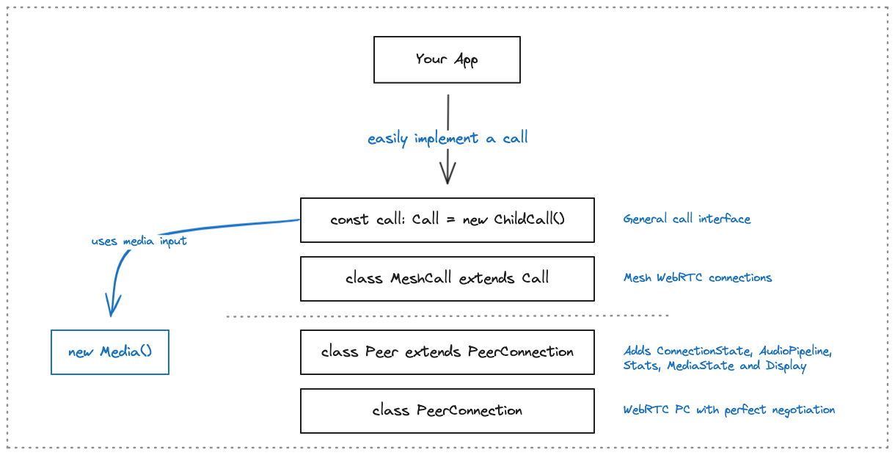

# `tui-rtc/call`

This module provides `Call` an class that abstracts functionality of a call signaling protocol.

Behavior of how to send and when to receive signals should be implemented by a subclass.
`MeshCall` is such a subclass that uses meshed WebRTC PeerConnection.

```ts
const call = new Call() // child class

call.media // Media, owns a media interface
call.mediaState // MediaState, created from `media`

call.join() // signal join to server

// display helpers
call.local.mediaState
call.local.micCamStream
call.local.screenStream
call.peers[peerId].mediaState
call.peers[peerId].micCamStream
call.peers[peerId].screenStream

```


