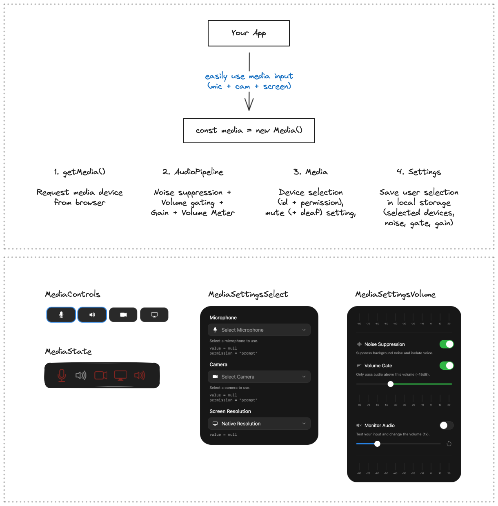

# `tui-rtc/media`

This module provides `Media` that interfaces with local media devices (mic, cam, screen) and
`AudioPipeline` that works on an audio stream and can perform noise suppression, volume gating and measure volume.

```ts
const media = new Media()

// Setup
media.mic_id = "deviceId123" // string | null (`null` -> default device)
media.mic_active = true // request device from browser, exposed output

// Optional Settings
media.mic_noiseSuppression = true
media.mic_volumeGate = -45 // dB
media.mic_gain = 1.25 // 125%
media.mic_playback = true // monitor audio

// Use Output
media.mic_audioOutput // track after pipeline
media.mic_volumeOutput // volume in dB
```


